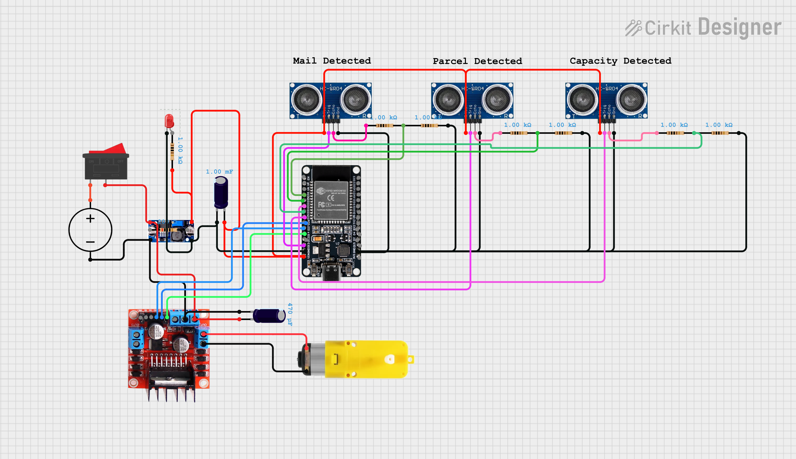

# Smart Drop — IoT Smart Mailbox System

> **Smart MailBox 2026 Project**
> A real-time IoT mailbox monitoring system that sends instant notifications to your phone when mail or parcels arrive.

---

## Table of Contents

- [About the Project](#about-the-project)
- [The Problem](#the-problem)
- [Our Solution](#our-solution)
- [Features](#features)
- [Hardware Components](#hardware-components)
- [Circuit Diagram](#circuit-diagram)
- [How It Works](#how-it-works)
- [System Architecture](#system-architecture)
- [Pin Map](#pin-map)
- [File Structure](#file-structure)
- [Telegram Bot Commands](#telegram-bot-commands)
- [Setup and Installation](#setup-and-installation)
- [Configuration](#configuration)

---

## About the Project

Smart Drop is an IoT device that attaches to any standard mailbox and turns it into a smart, connected device. It uses ultrasonic sensors and an ESP32 microcontroller to detect mail and parcels, then sends real-time alerts to your phone through Telegram. No more walking to the gate to check an empty mailbox.

---

## The Problem

Traditional physical mailboxes are completely silent. They give you no information about what is inside or when something arrived. This creates several real problems:

- Residents and office staff waste time walking to a distant gate only to find an empty box
- There is no proof of delivery, so disputes between couriers and residents over missing mail cannot be resolved
- Sensitive documents and personal letters are left unattended for hours, creating a security and privacy risk
- For elderly people or those with limited mobility, frequent trips to check the mailbox are physically difficult
- In schools and government offices, urgent documents can sit unnoticed for hours causing delays

---

## Our Solution

Smart Drop converts any existing mailbox into a smart device without replacing the mailbox itself. It uses three ultrasonic sensors to monitor the inside of the mailbox, detect incoming mail and parcels, and measure how full the box is. All alerts are sent instantly to your phone via Telegram.

### Key objectives

- Send real-time delivery notifications to registered mobile phones
- Detect both letters and parcels separately with dedicated sensors
- Monitor mailbox fill capacity so you know when it is getting full
- Automatically open and close a parcel door when a parcel is detected
- Support multiple users so everyone in a household or office gets notified
- Work reliably with a standard 12V power adapter

---

## Features

### Mail Detection
- Detects when a letter or envelope is placed in the mailbox
- Sends a single Telegram notification on arrival
- Resets automatically when mail is collected
- Ignores repeated false triggers using a 1-second cooldown window

### Parcel Door (Automated)
- A motor-driven drawer-style door handles parcel deliveries fully automatically
- When a parcel is detected, the system waits 2 seconds to confirm it is real
- Sends a "Parcel Detected" alert, then opens the door
- Waits for the parcel to drop into the secure compartment below
- Closes the door automatically after the parcel falls
- Sends a "Parcel Stored Safely" confirmation alert

### Mailbox Capacity Monitoring
- Measures how full the mailbox is as a percentage (0% to 100%)
- Sends a warning at 70% capacity
- Sends an urgent alert at 90% capacity
- Displays a visual capacity bar in Telegram (e.g. `[████████░░] 80%`)
- Resets alerts automatically when mail is collected

### Multi-User Support
- Up to 5 users can register to the same mailbox
- All registered users receive every notification
- Secure registration flow: First Name → Last Name → Mailbox Password
- User accounts are saved in ESP32 flash memory and survive power cuts

### Dual-Core Architecture
- Mail and parcel sensors run on Core 1 — they check every 100ms and are never blocked
- WiFi, Telegram, and commands run on Core 0 — they poll every 3 seconds
- Both cores communicate safely using FreeRTOS queues and mutexes
- Result: sensor response time of ~100ms instead of ~2200ms on a single core

---

## Hardware Components

| Component | Quantity | Purpose |
|---|---|---|
| ESP32 Development Board | 1 | Main microcontroller, WiFi, dual core |
| HC-SR04 Ultrasonic Sensor | 3 | Mail detection, parcel detection, capacity measurement |
| L298N Motor Driver Module | 1 | Controls the parcel door motor |
| Gear Motor (or DVD-ROM motor) | 1 | Opens and closes the parcel drawer door |
| 12V DC Power Adapter (500mA) | 1 | Main power supply |
| DC-DC Buck Converter (12V → 5V) | 1 | Steps down voltage for ESP32 and sensors |
| Capacitor 1000µF 16V | 1 | Input spike filter on MotorController|
| Capacitor 470µF 16V | 1 | Output ripple filter on power supply |
| Resistors 1kΩ | 6 | Voltage dividers for sensor ECHO pins (2 per sensor) |
| Resistor 220Ω | 1 | LED current limiter |
| LED | 1 | Power/status indicator |
| PCB Dot Board | 1 | Component mounting |
| Jumper Wires | — | Connections |

---

## Circuit Diagram



### Voltage Divider (Required on all ECHO pins)

Each HC-SR04 sensor outputs 5V on its ECHO pin. The ESP32 GPIO pins only accept up to 3.3V. A voltage divider is required on every ECHO pin to bring the signal down to a safe level.

```
HC-SR04 ECHO (5V)
        |
       [1kΩ]
        |
        +----→ GPIO pin (reads ~2.5V — safe)
        |
       [1kΩ]
        |
       GND
```

### Power Supply Circuit

```
12V Adapter (500mA)
        |
  C1 (1000µF)  ← input spike filter
        |
  Buck Converter (12V → 5V)
        |
  C2 (470µF)   ← output ripple filter
        |
      5V Rail
        ├──→ ESP32 VIN  (internal regulator steps to 3.3V)
        ├──→ HC-SR04 #1 VCC  (mail sensor)
        ├──→ HC-SR04 #2 VCC  (parcel sensor)
        └──→ HC-SR04 #3 VCC  (capacity sensor)

12V from adapter ──→ L298N 12V input  (motor power)
L298N OUT1/OUT2  ──→ Gear Motor
```

> **Important:** Capacitor polarity matters. The longer leg is positive (+) and must connect to the positive rail. The shorter leg is negative (−) and must connect to GND. Reversing polarity will damage or explode the capacitor.

---

## How It Works

The system runs through a continuous loop split across two processor cores.

### Core 1 — Sensor Core (every 100ms)

1. Reads HC-SR04 #1 (mail sensor) — if distance ≤ 5cm, mail is detected
2. Runs the parcel door state machine — manages the full automated parcel flow
3. Reads HC-SR04 #3 (capacity sensor) — checks fill percentage and triggers alerts if thresholds are crossed
4. Sends events to Core 0 via FreeRTOS queues

### Core 0 — Network Core (every 3 seconds)

1. Reads incoming events from queues (mail, parcel, capacity)
2. Sends the appropriate Telegram notification to all registered users
3. Polls Telegram for new commands from users
4. Handles user registration, login, and command responses
5. Reconnects WiFi automatically if the connection drops

### Parcel Door Flow (Fully Automatic)

```
Parcel placed in front of sensor (distance ≤ 8cm)
  ↓
Wait 2 seconds to confirm it is real
  ↓
Send Telegram: "📦 Parcel Detected! Door is opening."
  ↓
Motor opens drawer (runs for 2.5 seconds)
  ↓
Wait for parcel to fall into safe compartment (distance returns > 8cm)
  ↓
Wait 2 seconds after fall
  ↓
Motor closes drawer (runs for 2.5 seconds)
  ↓
Send Telegram: "✅ Parcel Stored Safely! Door is locked."
  ↓
5-second cooldown, then re-armed for next delivery
```

---

## System Architecture

```
                    ┌─────────────────────────────────────┐
                    │              ESP32                  │
                    │                                     │
   HC-SR04 #1 ───→  │  CORE 1 (SensorTask)                │
   HC-SR04 #2 ───→  │  Runs every 100ms                   │
   HC-SR04 #3 ───→  │  Never blocked by WiFi              │
                    │         │                           │
                    │    FreeRTOS Queues                  │
                    │    (mailQueue, parcelQueue,         │
                    │     capacityQueue)                  │
                    │         │                           │
                    │  CORE 0 (WiFiTask)                  │
    Telegram ──────→│  Polls Telegram every 3s            │
    Commands        │  Sends notifications                │
                    │  Manages user accounts              │
                    │                                     │
    L298N ←──────── │  GPIO 26, 27, 14                    │
    Motor           │                                     │
                    └─────────────────────────────────────┘
                                    │
                              Telegram Bot
                                    │
                         ┌──────────┴──────────┐
                    User Phone 1          User Phone 2
                    (notifications         (notifications
                     and commands)          and commands)
```

---

## Pin Map

| ESP32 GPIO | Component | Function |
|---|---|---|
| GPIO 13 | HC-SR04 #1 TRIG | Mail sensor trigger |
| GPIO 34 | HC-SR04 #1 ECHO | Mail sensor echo (via 1kΩ+1kΩ divider) |
| GPIO 25 | HC-SR04 #2 TRIG | Parcel sensor trigger |
| GPIO 35 | HC-SR04 #2 ECHO | Parcel sensor echo (via 1kΩ+1kΩ divider) |
| GPIO 32 | HC-SR04 #3 TRIG | Capacity sensor trigger |
| GPIO 33 | HC-SR04 #3 ECHO | Capacity sensor echo (via 1kΩ+1kΩ divider) |
| GPIO 26 | L298N IN1 | Motor direction A |
| GPIO 27 | L298N IN2 | Motor direction B |
| GPIO 14 | L298N ENA | Motor PWM speed control |
| GPIO 2 | LED | Power/status indicator |
| VIN | Buck converter 5V output | ESP32 power input |
| GND | Common ground | All components share this |

> **Note:** GPIO 34 and 35 are input-only pins on the ESP32. They have no internal pull-up resistors, which makes them ideal for voltage divider circuits.

---

## File Structure

```
Smart-MailBox-IOT-Project/
├── src/
│   ├── main.cpp              # Main program — FreeRTOS tasks, Telegram, user auth
│   ├── Mail_Detected.h       # HC-SR04 #1 mail detection logic
│   ├── Parcel_Door.h         # HC-SR04 #2 + L298N parcel door state machine
│   └── Mailbox_Capacity.h    # HC-SR04 #3 capacity measurement and alerts
├── document/
│   └── circuit_diagram.png   # Full wiring and circuit diagram
├── platformio.ini            # PlatformIO project configuration
├── .gitignore                # Git ignore rules
└── README.md                 # This file
```

---

## Telegram Bot Commands

Once registered, every user can send these commands to the bot:

| Command | Description |
|---|---|
| `active` | Switch to Active Mode — WiFi stays on permanently |
| `sleep` | Switch to Sleep Mode — WiFi turns off between checks |
| `status` | Show current mode and login information |
| `sensor` | Show live distance reading from the mail sensor |
| `door` | Show current parcel door state and sensor reading |
| `capacity` | Show mailbox fill percentage with a visual bar |
| `logout` | Delete your account from the mailbox |

### User Registration Flow

When a new phone sends any message to the bot:

```
Bot: "Welcome! Please enter your First Name."
You: John
Bot: "Got it! Now enter your Last Name."
You: Smith
Bot: "Enter the Mailbox Password."
You: 1234
Bot: "Registration successful! You will now receive all notifications."
```

The password is set in `main.cpp` under `MAILBOX_PASSWORD`. Up to 5 users can register.

---

## Setup and Installation

### Requirements

- [PlatformIO](https://platformio.org/) (recommended) or Arduino IDE
- ESP32 board support package
- Libraries: `UniversalTelegramBot`, `ArduinoJson`

### Steps

1. Clone this repository
   ```bash
   git clone https://github.com/DilumTharinda/Smart-MailBox-IOT-Project.git
   cd Smart-MailBox-IOT-Project
   ```

2. Open in VS Code with PlatformIO extension installed

3. Edit the credentials in `src/main.cpp`
   ```cpp
   const char* WIFI_SSID        = "YourWiFiName";
   const char* WIFI_PASSWORD    = "YourWiFiPassword";
   const char* BOT_TOKEN        = "YourTelegramBotToken";
   const char* MAILBOX_PASSWORD = "1234";
   ```

4. Measure the internal height of your mailbox and set it in `src/Mailbox_Capacity.h`
   ```cpp
   #define CAP_BOX_HEIGHT_CM   20.0f   // set this to your actual box height
   ```

5. Build and upload
   ```bash
   pio run --target upload
   ```

6. Open Serial Monitor at 115200 baud to verify startup

### Creating a Telegram Bot

1. Open Telegram and search for `@BotFather`
2. Send `/newbot` and follow the prompts
3. Copy the token BotFather gives you into `BOT_TOKEN` in `main.cpp`

---

## Configuration

All key settings are defined as constants at the top of each file and can be tuned without changing any logic.

### main.cpp

| Constant | Default | Description |
|---|---|---|
| `SENSOR_CHECK_MS` | 100 | How often Core 1 reads sensors (milliseconds) |
| `TELEGRAM_CHECK_MS` | 3000 | How often Core 0 polls Telegram for commands |
| `MAX_USERS` | 5 | Maximum number of registered users |

### Parcel_Door.h

| Constant | Default | Description |
|---|---|---|
| `PARCEL_DISTANCE_CM` | 8 | Distance threshold to detect parcel (cm) |
| `PARCEL_DETECT_WAIT_MS` | 2000 | Wait time to confirm parcel before acting (ms) |
| `PARCEL_FALL_WAIT_MS` | 2000 | Wait time after parcel falls before closing (ms) |
| `DOOR_OPEN_TIME_MS` | 2500 | Time for motor to fully open the drawer (ms) |
| `DOOR_CLOSE_TIME_MS` | 2500 | Time for motor to fully close the drawer (ms) |
| `PARCEL_TIMEOUT_MS` | 30000 | Safety auto-close if parcel never detected (ms) |
| `MOTOR_SPEED` | 200 | Motor PWM speed 0–255 (~78% speed) |

### Mailbox_Capacity.h

| Constant | Default | Description |
|---|---|---|
| `CAP_BOX_HEIGHT_CM` | 20.0 | Internal height of mailbox — **measure and set this** |
| `CAP_NEAR_FULL_THRESHOLD` | 70 | Send warning alert at this percentage |
| `CAP_FULL_THRESHOLD` | 90 | Send urgent alert at this percentage |

### Mail_Detected.h

| Constant | Default | Description |
|---|---|---|
| `MAIL_DISTANCE_CM` | 5 | Distance threshold to detect mail (cm) |
| `DUPLICATE_WINDOW_MS` | 1000 | Ignore repeated triggers within this window (ms) |

---

> Prices are estimates based on local Sri Lankan market rates at the time of purchase (Pettah / local electronics shops). Actual prices may vary.

---

---

## License

This project was built for educational purposes